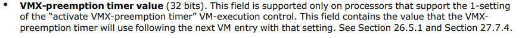

# 多VM支持

前言：跟着佬的博客学习，敲了一遍，[原文地址](https://github.com/PeizhongQiu/rcore_pro4)

## 基础要求

至少在一个架构上实现：在单个物理核心上并发运行至少2台虚拟机，每台虚拟机1个虚拟CPU。要求实现虚拟机和虚拟CPU相关信息的管理和切换、虚拟CPU的调度、不同虚拟机间虚拟设备的隔离。


## 核心思想

在单cpu上，利用时钟中断，进行vm的切换。vmcs区域中有一个VMX_PREEMPTION_TIMER_VALUE字段。作用如图



为了使用该字段值达到利用时钟切换的目的，我们需要新增一个退出信息以及退出信息的处理，在PINBASED_EXEC_CONTROLS中设置该操作允许执行，以及在切换vm后重新设置该值


代码方面十分简单，我们只需要创建两个VM，然后交替加载即可

首先我们创建一个封装类

```rust
#[repr(C)]
pub struct VM<H: HyperCraftHal> {
    id: usize,
    vcpu_count: usize,
    vcpu: Vec<VmxVcpu<H>>,
}
impl<H: HyperCraftHal> VM<H> {
    /// create new VM
    pub fn new(
        id: usize,
    ) -> Self {
        Self {
            id: id,
            vcpu_count: 0,
            vcpu: Vec::new(),
        }
    }
    /// add a new vcpu to VM
    pub fn add_vcpu(&mut self, vmcs_revision_id: u32, entry: GuestPhysAddr, npt_root: HostPhysAddr) -> HyperResult<usize> {
        self.vcpu.push(VmxVcpu::new(self.id, self.vcpu_count,vmcs_revision_id, entry, npt_root)?);
        // update vcpu_count
        self.vcpu_count += 1;
        Ok(self.vcpu_count - 1)
    }
    /// Returns a reference to the vCPU with `vcpu_id` if it exists.
    pub fn get_vcpu(&mut self, vcpu_id: usize) -> HyperResult<&mut VmxVcpu<H>> {
        info!("{} {}", vcpu_id, self.vcpu_count);
        if vcpu_id < self.vcpu_count {
            let vcpu = &mut self.vcpu[vcpu_id];
            Ok(vcpu)
        } else {
            Err(HyperError::NotFound)
        }
        
    }
    /// get vm id
    pub fn get_vm_id(&self) -> usize{
        self.id
    }
}
```

然后去更改vcpu的初始化，主要是修改setup_vmcs_control 函数，修改 PINBASED_EXEC_CONTROLS，VMEXIT_CONTROLS，以及添加VMX_PREEMPTION_TIMER_VALUE的写入。

```rust
pub fn load_vmcs(&self) -> HyperResult {
    let paddr = self.vmcs.phys_addr() as u64;
    unsafe {
        vmx::vmptrld(paddr)?;
    }
    VmcsGuest32::VMX_PREEMPTION_TIMER_VALUE.write(PREEMPTION_TIMER_VALUE)?;
    Ok(())
}
```

在结束了这些之后，我们需要去处理虚拟机的隔离，主要是隔了IO地址与APIC地址，同时，我们要修改load_guest_image，新增一个虚拟机id的参数


新增

```rust
pub(super) static mut GUEST_PHYS_MEMORY: [AlignedMemory<GUEST_PHYS_MEMORY_SIZE>;MAX_VMS]=
    [AlignedMemory([0; GUEST_PHYS_MEMORY_SIZE]);MAX_VMS];
pub(super) static mut IO_PHYS_MEMORY: [AlignedMemory<0x1000>;MAX_VMS]=
    [AlignedMemory([0; 0x1000]);MAX_VMS];
pub(super) static mut LAPIC_PHYS_MEMORY: [AlignedMemory<0x1000>;MAX_VMS]=
    [AlignedMemory([0; 0x1000]);MAX_VMS];
```

在setup_gpm里修改地址分配

```rust
let mut guest_memory_regions = [
        GuestMemoryRegion {
            // RAM
            gpa: GUEST_PHYS_MEMORY_BASE,
            hpa: virt_to_phys((gpa_as_mut_ptr(GUEST_PHYS_MEMORY_BASE, id) as HostVirtAddr).into()).into(),
            // hpa: hpa_base,
            size: GUEST_PHYS_MEMORY_SIZE,
            flags: MappingFlags::READ | MappingFlags::WRITE | MappingFlags::EXECUTE,
        },
        GuestMemoryRegion {
            // IO APIC
            gpa: 0xfec0_0000,
            hpa: unsafe { &IO_PHYS_MEMORY[id] as *const _ as usize },
            size: 0x1000,
            flags: MappingFlags::READ | MappingFlags::WRITE | MappingFlags::DEVICE,
        },
        GuestMemoryRegion {
            // HPET
            gpa: 0xfed0_0000,
            hpa: 0xfed0_0000,
            size: 0x1000,
            flags: MappingFlags::READ | MappingFlags::WRITE | MappingFlags::DEVICE,
        },
        GuestMemoryRegion {
            // Local APIC
            gpa: 0xfee0_0000,
            hpa: unsafe { &LAPIC_PHYS_MEMORY[id] as *const _ as usize },
            size: 0x1000,
            flags: MappingFlags::READ | MappingFlags::WRITE | MappingFlags::DEVICE,
        }
    ];
```


最后，在main函数中启用两个线程进行测试

```rust
fn main(hart_id: usize) {
    println!("Hello, hv!");
    println!("into main {}", hart_id);
    let mut p = PerCpu::<HyperCraftHalImpl>::new(hart_id);
    p.hardware_enable().unwrap();
    let vmcs_revision_id = p.get_vmcs_revision_id();
    for id in 0..NUM_VM {
        thread::spawn(move || {
            let gpm = x64::setup_gpm(id).unwrap();
            let mut vm = VM::<HyperCraftHalImpl>::new(id);
            let vcpu_id = vm.add_vcpu(vmcs_revision_id, x64::BIOS_ENTRY, gpm.nest_page_table_root()).unwrap();
            let vcpu = vm.get_vcpu(vcpu_id).unwrap();
            vcpu.run();
        });
    }
    p.hardware_disable().unwrap();
    return;

}
```

